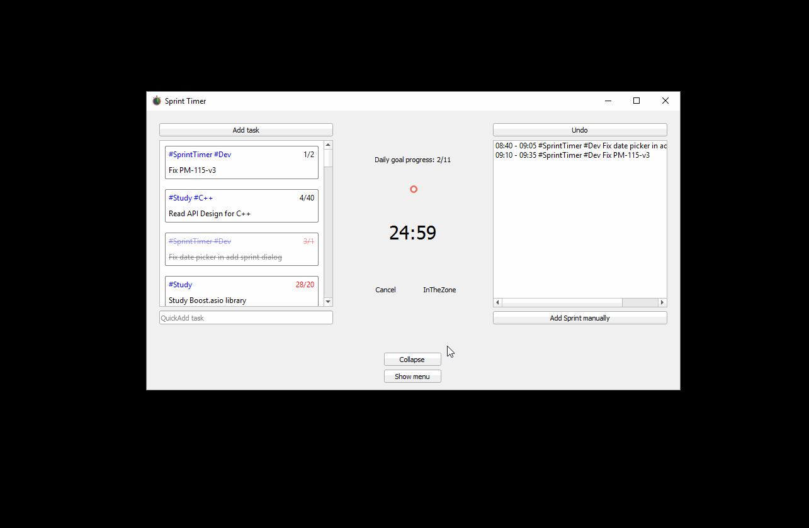

### Intro
SprintTimer is a desktop application inspired by Pomodoro Technique®.

The Pomodoro Technique® is a very simple and effective time management technique that helps you keep focused on tasks
 that require long periods of concentration. Read more about it at the official website.
You can read more about technique at the [official website](http://pomodorotechnique.com).


Pomodoro Technique® and Pomodoro™ are registered and filed trademarks owned by Francesco Cirillo. SprintTimer is not affiliated by, associated with nor endorsed by Francesco Cirillo.


### Features and description
SprintTimer is best suited for people that work with computers most of their time.
It is a tool that helps to deal with time-framed tasks effectively. It encourages you to fully concentrate on task at hand for a limited ammount of time (this time interval is called *sprint* in terms of this application). It then encourages you to take a short break and, after some more sprints, a longer break; then the cycle repeats. It is a very simple and widely known technique, that can be used with any timer, paper and pen, but SprintTimer application provides the following benefits:

* it features task list (that is deliberately made small, as it intended to contain task for 1-2 days)
* it stores every task and sprint and is able to answer some statistical queries for any period of time;
* it features history view - you can easily see what tasks had been done in, say, August 15 of the last year;
* it features progress view that allows you to quickly observe progress for last 30 days, last 4 months and last year;
* there are times when you are in the flow and don't want to be distracted - just click *InTheZone* button and sprints will be run without breaks and notifications and then be all stored when you finished.

### SprintTimer in action


### Dependencies

Versions up to 0.6.3 can be build with C++ compiler that supports C++17. Higher versions will require C++20 support
std::filesystem library
CMake version 3.15+
Qt framework, version 5.x
SQLite3 any revision
Boost libraries 1.60+ (probably dependency will be removed later)

### Binary releases

For now binary releases are not provided, you have to build from source.

### Building from source

Note that develop branch is unstable and is not guaranteed to build on all platforms.

This project uses CMake to generate project files for different build systems.

Some optional CMake variables:
* WARNINGS_AS_ERRORS Treat compiler warnings as errors
* ENABLE_TESTING build tests
* ENABLE_SANITIZER_ADDRESS
* ENABLE_SANITIZER_LEAK
* ENABLE_SANITIZER_UNDEFINED_BEHAVIOR
* ENABLE_SANITIZER_THREAD
* ENABLE_SANITIZER_MEMORY

#### Linux

Build is tested with GNU and clang compilers.

Example of building release version:

```shell
mkdir build && cd build && cmake -DBUILD_TYPE=Release ..
cmake --build . --config Release
```

#### Windows
Build is tested with MSVC compiler.

1. Make sure you have all dependencies installed (or built from source).
2. Open command prompt and navigate to build directory of cloned repo.
3. Generate Visual Studio project files. In following example (with actual paths replaced with placeholders) project files for Visual Studio 2017 are generated:
```shell
cmake .. -G "Visual Studio 15 Win64" -DCMAKE_PREFIX_PATH=<Path to Qt installation>\msvc2017_64 -DCMAKE_INCLUDE_PATH=<Path to Boost> -DCMAKE_WINDOWS_EXPORT_ALL_SYMBOLS=TRUE -DBUILD_SHARED_LIBS=TRUE
```

4. Build project:
```shell
cmake --build . --config Release
```

Before running executable, make sure that path to Qt installation is added to system path.
Alternatively, you can copy required dll's manually.
Assuming that you have built Release version: navigate to <Qt directory>/bin/Release,
copy following dll's from Qt installation for your compiler bin folder to repo/bin/Release folder:

Qt5Core.dll

Qt5Gui.dll

Qt5Multimedia.dll

Qt5Network.dll

Qt5Sql.dll

Qt5Widgets.dll

It might be required to copy to the same folder from Qt installation plugins folder following plugins (creating folders as needed):

audio/qtaudio_windows.dll

sqldrivers/qsqlite.dll

#### Mac OS X

NOTE

Latest version that can be build on Mac OS X is 0.6.3

Since version 0.6.4 compiler with C++20 support is required. For now both apple clang and llvm clang are unable to build project due to lack of feature support (concepts support is partial).

Install dependencies and Xcode.
As Apple clang compiler shipped with the system might use outdated standard library, it might not be sufficient.
One way to overcome this is to install latest llvm with homebrew:

```shell
brew install llvm
```

Note that depending on your Qt installation type, you might need to change LDFLAGS and/or CPPFLAGS and adjust path to Qt, refer to Qt documentation.
For example, if Qt 5.11.2 is installed with homebrew, project can be built with:

```shell
(cd build && LDFLAGS="-L/usr/local/opt/llvm/lib" CPPFLAGS="-I/usr/local/opt/llvm/include" CC="$(brew --prefix llvm)/bin/clang" CXX="$(brew --prefix llvm)/bin/clang++" cmake -DQt5_DIR="$(brew --cellar qt5)/5.11.2/lib/cmake/Qt5" .. && cmake --build . --config Release)
```

If you want to create installer:
```shell
(cd build && make package)
```

Then find sprint_timer_app.dmg inside build directory.

Note: for correct timer count App Nap feature should be manually disabled for SprintTimer app.

#### Building tests
To build test suite option BUILD_TEST=ON should be passed to cmake.

### Known issues
* Some text labels might be cropped and some GUI elements might be too small/large on smaller resolution screens.
* Long break counter resets after midnight.
* On Mac OS user is required to disable App Nap feature manually.
